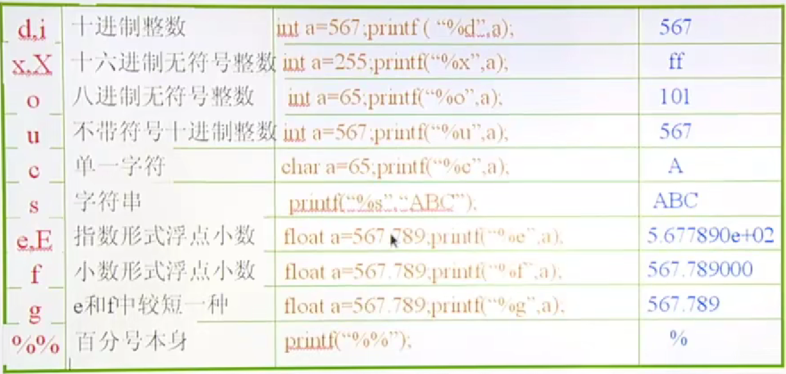
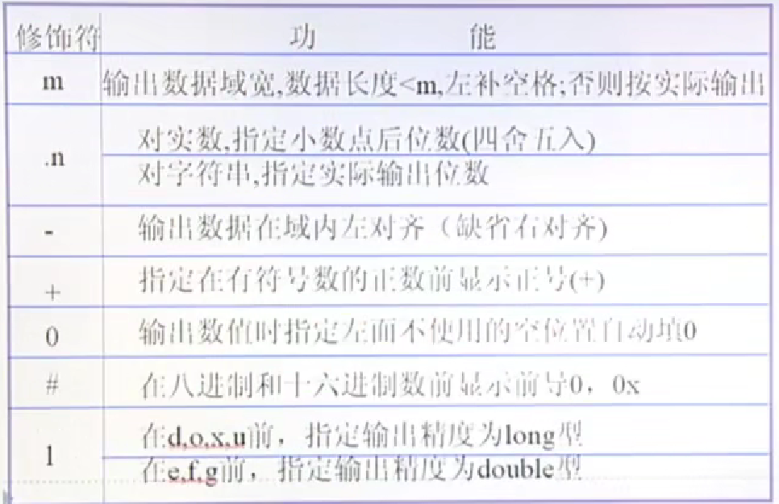

# 输入输出

`printf("[修饰字符]格式字符", 输出表项)`

## 输出 printf

### 格式字符



```c
int main() {
  int i = 123;
  printf("%4d\n", i);
  
  float f = 1.23455;
  printf("%.3f\n", f);
  
  char* s= "helloworld";
  printf("%10.5s\n", s);
}
```

### 修饰字符



在输出为八进制和十六进制的时候，最好加上`#`，这样才能够方便看出来是什么进制的数。

```c
#define SEC_YEAR (60LL * 60LL * 24LL * 365LL)
//* 注意数据是否会溢出

printf("%ld\n", long);
printf("%lf\n", double);
```

### 刷新缓冲区

`printf`检测报错时，必须要加上`\n`，否则会因为缓冲区没有刷新，不会出现语句打印。

```c
    printf("[%s:%d] before while().\n", _FUNCTION_, __LINE__);
```

## 输出scanf

### 格式字符的注意事项

输出`scanf("%d%f")`中间最好不要加上符号，包括空格。它能够在你输入的时候自动包括空格、换行符。

```c
#define STR_SIZE 32 // 注意字符串要预留一个尾0，所以只能接受31个字符！！！
char str[str_size];
scanf("%s", str);
printf("%s\n", str);
```

1. 此时如果输入`hello world`，程序只能够输出`hello`,因为`%s`不能够识别空格。

2. 在`scanf`中，如果是`%s`，那么比较危险，因为他不会停止输入,不知道存储空间的大小，譬如你规定31个字符，你可以输入60个甚至更多的字符

### 循环语句scanf的校验

```c
int main() {
  int ret = 0;
  int d = 0;
  
  while(1) {
    ret = scanf("%d", d);
    if (ret == -1) {
      perror("Error");
      break;
    }
    printf("&d\n", d);
  }
  exit(0);
}
```

1. 在循环语句中输入`scanf`，一定要校验，否则如果输入的格式有错误（譬如需要输入一个整数，但是你输入的是一个字母，那么就会出现死循环），就可能会有意想不到的结果出现。

### 多个输入时，抑制符的使用

```c
int main() {
  int i = 0;
  char c = 0;
  
  scanf("%d", &i);
  scanf("%*c%c", &c); //抑制符的使用 
  // 或者
  //getchar();
  //scanf("%c", &c);
  printf("i = %d, c = %c", i, c);
}
```

`%*c`：这部分表示读取一个字符，但是由于前面有 *，表示该字符将被读取但被忽略，即不会被保存到任何变量中。

## 字符输入输出函数：`getchar`,`putchar`

## 字符串输入输出函数： `gets()`, `puts()`

`gets()` 很危险，不检测缓存是否已经满了。可以使用`getline()`来代替

```c
ssize_t getline(char **lineptr, size_t *n, FILE *stream);
```