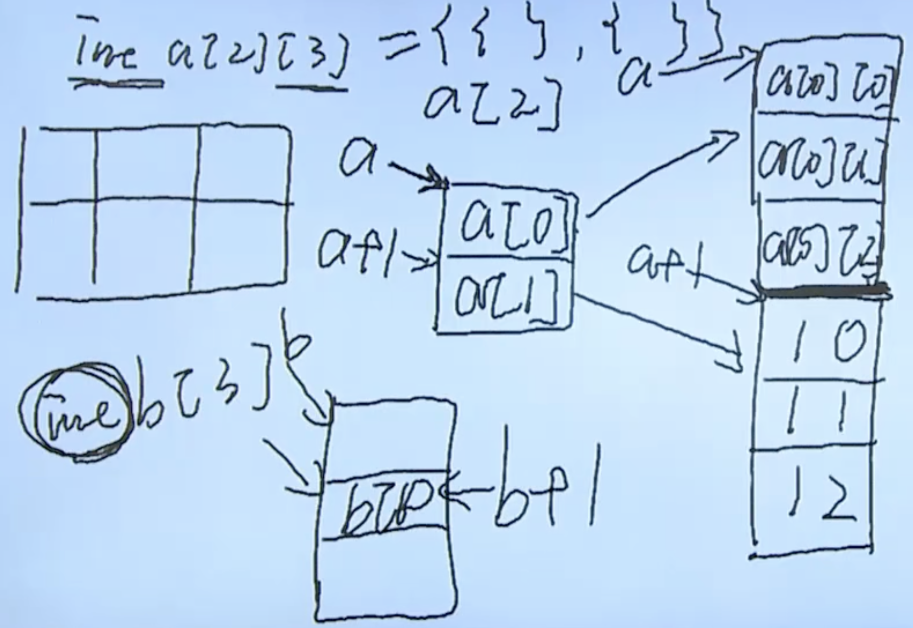

# 数组

## 一维数组

### 定义

### 初始化

1. 不初始化
2. 全部初始化
3. 部分初始化
4. static， 就算没有初始化，或者部分初始化，剩余元素被初始化为0 

### 引用

打印数组地址`printf("arr = %p\n", arr)`

### 数组名

数组名是表示地址的常量，也是数组的起始位置

### 数组越界

`a[i] = *(a+i)`

## 二维数组



## 字符数组

### 输入输出

`puts(str)`
`scanf("%s", str)` 无法越过空格，譬如”hello world"只能读取hello。

字符数组含有尾零。

### 函数

```c
#include <stdio.h>
#include <stdlib.h>
#include<string.h>
#define STRSIZE 32
int main () {
    char str[32] = "hello\0abc";
    printf("%lu\n", strlen(str)); // 以尾零作为结束 结果是5
    printf("%lu\n", sizeof(str)); // 字符串真正占用的个数 结果是10
                                 // 
    puts(str); //也是以尾零作为结束
    //**************************************

    strcpy(str, "abcdef"); //注意，这里是把abcdef\0复制到str中，所以str的长度是7
                           //也是以尾零作为结束

    char newstr [STRSIZE]; 
    strncpy(newstr, "abnc", STRSIZE); //最多能够复制STRSIZE-1个字符，最后一个字符是尾零

    //**************************************
    strncat(newstr, " ", STRSIZE);//最多能够复制STRSIZE-1个字符，最后一个字符是尾零

    //**************************************
    strcmp(str, newstr); //比较两个字符串，相等返回0，str大返回正数，newstr大返回负数
    // *通过ASCALL码进行比较
    strncmp(str, newstr, 3); // 比较前三个字符
    return 0;
}
```
