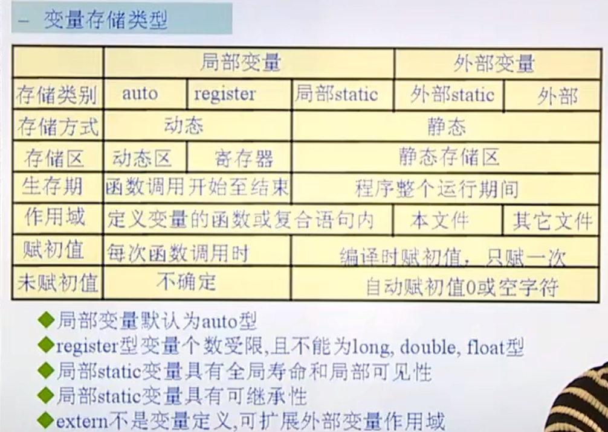

# 常量与变量

## 常量：在程序执行过程中值不会发生变化的量。

ps:数组就是常量，应为在一开始就已经分配了相应的内存。

### 分类

1. 整形常量： 1， 790， 200
2. 实型常量： 3.14 5.36
3. 字符常量: 由单引号引起的单个字符或者*转义字符*
   * `'\015'`, `'\0x7f'`, `'a'`
   * `\ddd`1到3位八进制数所代表的任意字符,*三位八进制*
   * `\xhh`十六进制所代表的任意字符,*二位十六进制*
   * `\018`**是错误的，因为八进制没有8这个数字**
4. 字符串常量： 由*双引号*引起来的一个或多个字符组成的序列(包括空串)
   * 如 `""`,代表里面没有有效字符，只有一个 `\0`,占一个字节
   * `"abc"`, `"abcd\n\023"`, `"a"`
5. 标识常量： `#define`
   * 不做语法检查，直接替换,一改全改，不检查语法，只是单纯的替换
   * 一定要将所有的参数带上括号 `#define Max(a,b) (a) > (b) ? (a) : (b)`，否则会出现运算符优先的问题
   * 处理在程序的预处理阶段,宏占用的是编译时间，而函数占用的是运行时间
   * 在涉及到自增自检运算符的时候，要格外注意,可以做如下的替换

```c
#define Max(a,b) ({int A = (a),B = (b); ((A) > (B) ? (A) : (B));})
//更进一步
#define Max(a,b) ({typeof(a) A = (a),B = (b); ((A) > (B) ? (A) : (B));})
```

## 变量：用来保存一些特定的内容，并且在程序执行过程中值随时会发生变化的量

1. 定义： TYPE NAME = VALUE; [存储类型] 数据类型 标识符 = 值
   * 标识符：由字母，数字，下划线组成且不能够以数字开头的一个标识序列
   * 数据类型：基本数据类型 + 构造类型
   * 存储类型： `auto`, `static`, `register`, `extern`(说明型)
     auto:默认，自动分配空间，自动回收空间
     register：（建议型）寄存器类型。
     + 只能定义局部变量，不能定义全局变量。
     + 大小有限制，如果是32位机器，那就只能定义32位大小的数据类型，如 `double`就不可以
     + 寄存器没有地址，所以一个寄存器变量的无法打印出地址进行查看或使用。
   * static 静态型，自动初始化为0或者空值，并且其变量的值具有继承性
     且定义只会被调用一次,常用来修饰变量或者函数。
     当用来修饰函数的时候，作用为：**防止对外扩展**，即只有本文件能够使用这个函数，而其它文件不能够使用
   * extern 说明型，意味着不能够改变被说明的变量或者值或者类型

## 变量的生命周期和作用范围

### 全局变量和局部变量

### 局部变量和局部变量

作用范围永远是最内层的屏蔽最外层的。



## static详解

### 修饰函数

在C语言中，`static` 关键字用于修饰函数时有两个不同的含义，具体取决于 `static` 出现的上下文。

1. **在函数内部使用 `static`：**

   当 `static` 用于修饰函数内部的局部变量时，它表示该变量具有静态生存期，即该变量在程序的整个执行过程中都存在，而不是在函数调用结束后销毁。此时，该变量的作用范围仅限于包含它的函数。这可以防止该变量被外部函数访问。

   ```c
   void exampleFunction() {
       static int counter = 0;  // 静态局部变量
       counter++;
       printf("Counter: %d\n", counter);
   }
   ```

   在上述例子中，`counter` 是一个静态局部变量，它在 `exampleFunction` 调用之间保留其值。
2. **在函数声明中使用 `static`：**

   当 `static` 用于函数声明时，它表示该函数仅在声明它的源文件中可见，防止该函数被其他源文件中的函数调用。这通常被称为“内部链接”或“文件作用域”。

   ```c
   // 文件 scope.c
   static void internalFunction() {
       // ...
   }
   ```

   在上述例子中，`internalFunction` 只能在 `scope.c` 文件中调用，其他文件无法访问该函数。

   总的来说，当 `static` 用于函数时，它的主要作用是将函数的链接属性限制在声明它的源文件内，防止对外扩展，或者用于修饰函数内的局部变量，使其具有静态生存期和仅在函数内部可见。

### 修饰变量

static 修饰的局部变量在函数调用之间会保留其值，并且不会被重新声明

`static` 修饰的局部变量在函数调用之间会保留其值，并且不会被重新声明。在下面的例子中，`counter` 变量在函数调用之间保持其值，而不会被重新声明：

```c
#include <stdio.h>

void exampleFunction() {
    static int counter = 0;  // 静态局部变量
    counter++;
    printf("Counter: %d\n", counter);
}

int main() {
    exampleFunction();  // 输出 Counter: 1
    exampleFunction();  // 输出 Counter: 2
    exampleFunction();  // 输出 Counter: 3

    return 0;
}
```

在这个例子中，`counter` 是一个静态局部变量，它在 `exampleFunction` 调用之间保留其值。每次调用 `exampleFunction` 都会增加 `counter` 的值，并且该值在函数调用之间保持不变。输出将是：

```c
Counter: 1
Counter: 2
Counter: 3
```

所以你的理解是正确的，`counter` 不会在每次函数调用时重新声明，而是在程序的生命周期内保持其值。

在C语言中，`static` 修饰变量时有两个主要作用：静态生存期和限制作用域。

#### 静态生存期：

当 `static` 用于局部变量时，它改变了变量的生存期，使其具有静态生存期。这意味着该变量在程序的整个执行过程中都存在，而不是在包含它的块（例如函数）的执行期间存在。静态生存期的变量在程序开始运行时初始化，并在程序结束时销毁。

```c
#include <stdio.h>

void exampleFunction() {
    static int counter = 0;  // 静态局部变量
    counter++;
    printf("Counter: %d\n", counter);
}

int main() {
    exampleFunction();  // 输出 Counter: 1
    exampleFunction();  // 输出 Counter: 2
    exampleFunction();  // 输出 Counter: 3

    return 0;
}
```

在上述例子中，`counter` 是一个静态局部变量，每次调用 `exampleFunction` 时，它都会保留其值，而不会被重新声明。输出将是：

```
Counter: 1
Counter: 2
Counter: 3
```

#### 限制作用域：

当 `static` 用于全局变量或函数时，它限制了变量或函数的作用域，使其仅在声明它的源文件中可见。这通常被称为“内部链接”或“文件作用域”。

```c
// 文件 scope.c
static int globalCounter = 0;  // 具有文件作用域的静态全局变量

static void internalFunction() {
    // ...
}
```

在上述例子中，`globalCounter` 是一个具有文件作用域的静态全局变量，它只能在 `scope.c` 文件中访问。同样，`internalFunction` 也是一个具有文件作用域的静态函数，只能在 `scope.c` 文件中调用。

这两个作用使得 `static` 在不同的上下文中有不同的意义，但都与变量的生存期和作用域有关。
